{width="6.5in" height="2.3402777777777777in"}\
\
Data sets were downloaded from the linked website and easily merged
using a dos command prompt due to the gigantic nature of the data. 2015
through 2018 was chosen because 2019 data was incomplete. 2013 and 2014
may have bad data and having not completely refined their process yet
may not have a full data set. For sake of size and time and interest in
comparing data over years, a very large data set of over 53 million
records are analyzed below.\
\
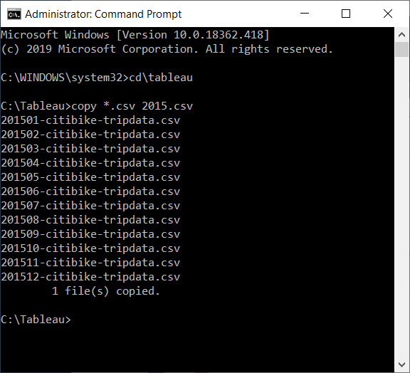{width="4.706106736657918in" height="4.28125in"}\
\
To complement the learning done in class, I completed the **Linkedin
Learning: Cleaning, Transforming and Prepping Your Data With Tableau
Prep** course online in order to be skilled with using Tableau Prep
Builder 2019.3 to clean such a huge dataset. I also followed along to
**Linkedin Learning: Creating Interactive Tableau Dashboards**\
\
\
\
\
**Key Filtering Steps:**\
\
Kept trip duration \<25000 seconds.\
Birth year \> 1930 and removed null values\
\
cleaned 2017 column names that needed to be renamed to align with 2015,
2016 & 2018 data so that the resulting fields would have no mismatching
fields.

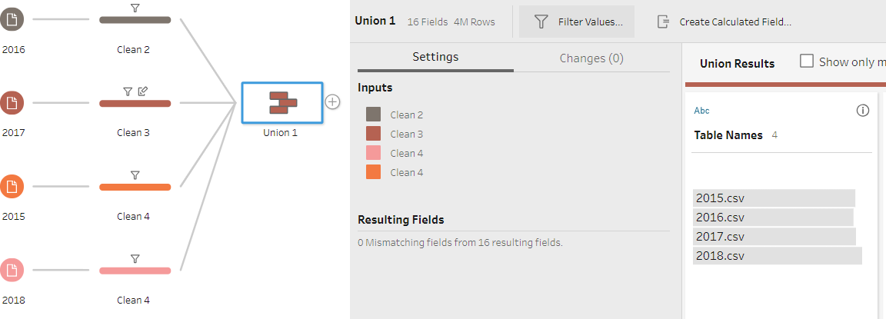{width="6.5in" height="2.341666666666667in"}

Removed latitude & longitude extreme outliers & labeled gender as Male,
Female and Unknown.

!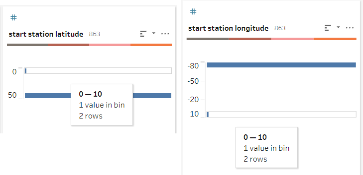{width="6.5in" height="3.147222222222222in"}

**Tableau Prep Builder 2019.3 \| Output File.** {width="6.5in" height="2.870138888888889in"}
=================================================================================================================

Combining the output of 2015, 2016, 2017 & 2018 with my filters took
over 30 minutes to generated providing me with over 53 million records.

Even more excitement brewed than just with the quick preview from the
union stencil output to Tableau Desktop. The 1969 anomaly was even
highlighted even more by creating some quick graphs quickly showed a
spike in 1969 of 'unknown' gender with over 1.3 million records. I will
dismiss this data has probably the unknown defaults in some sort of form
entry defaults. Having the Gender, Birth Year as columns and Sum of all
records below produced this interesting spike in confused 50 year olds.

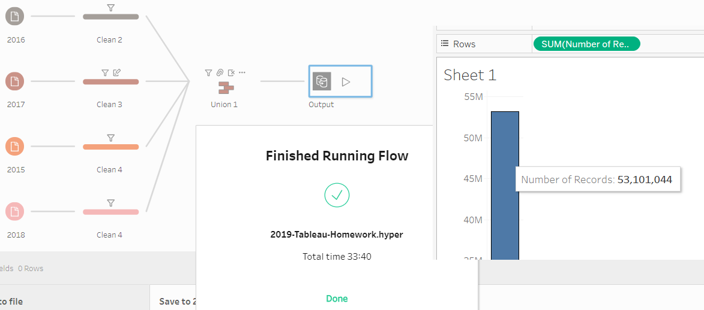{width="4.989583333333333in"
height="3.237898075240595in"}

By removing the sorted Gender and just using the birth year and sum of
records, the spike was quite obvious.\
\
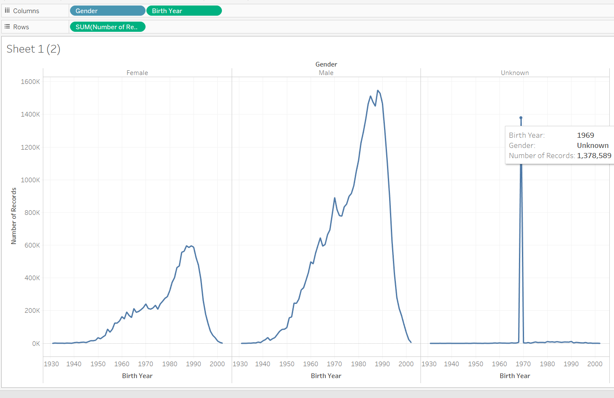{width="6.5in" height="4.204861111111111in"}\
\
By removing the unknown gender as a filter we achieve a very nice
graph.\
\
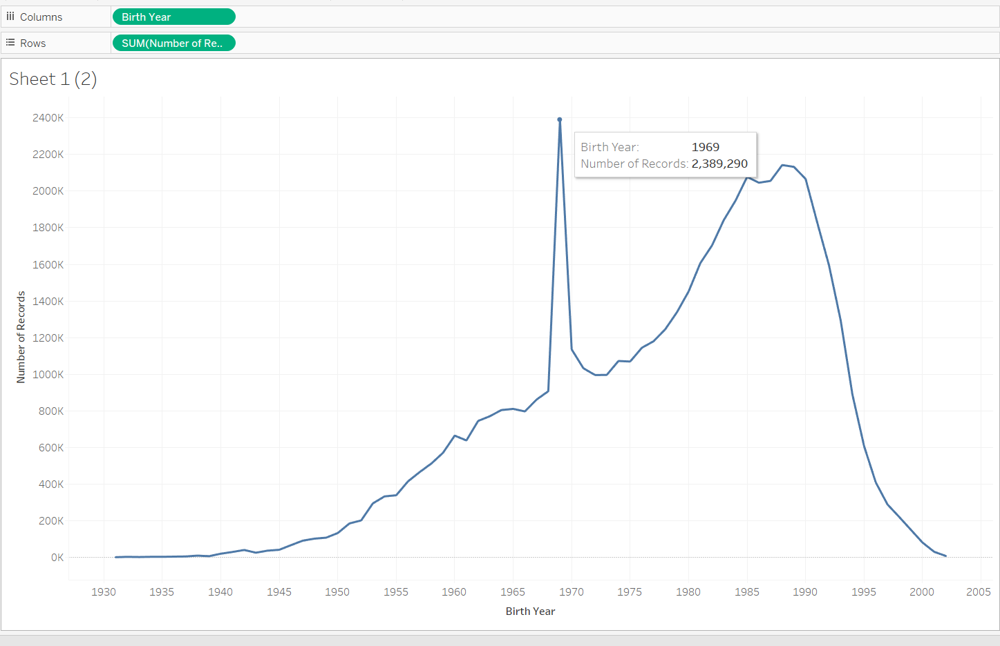{width="6.5in" height="4.09375in"}\
\
\
\
**Data Utilized: 2015, 2016, 2017, 2018:**\
\
Questions to Answer:

1.  **How many trips have been recorded total during the chosen
    period?**\
    51.5 million trips have been recorded utilizing the data from 2015
    to the end of 2018.

    a.  2015: 8.6 million

    b.  2016: 12.2 million

    c.  2017: 14.7 million

    d.  2018: 16 million\
        \
        \
        {width="2.619832677165354in"
        height="3.9375in"}

2.  **By what percentage has total ridership grown?**
    =================================================

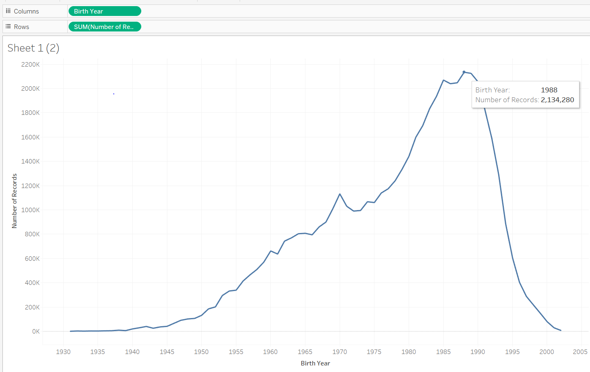{width="6.5in" height="4.226388888888889in"}

 This rider growth graph shows the growth continuation from Jan 2015 to
 Dec 31th 2018. There is a gap in the data for Q4 of 2016 between
 September 26^th^ 2016 to Dec 31^st^ 2016.

3\. How has the proportion of short-term customers and annual subscribers
changed?\
\
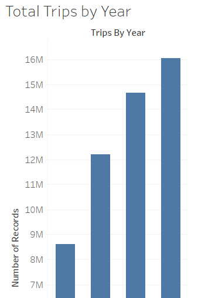{width="6.5in" height="4.238194444444445in"}\
\
It's logical to see how the drop off of subscribers in Q1 of every year
it being the winter months in New York.

**4. What are the peak hours in which bikes are used during summer
months?\
\
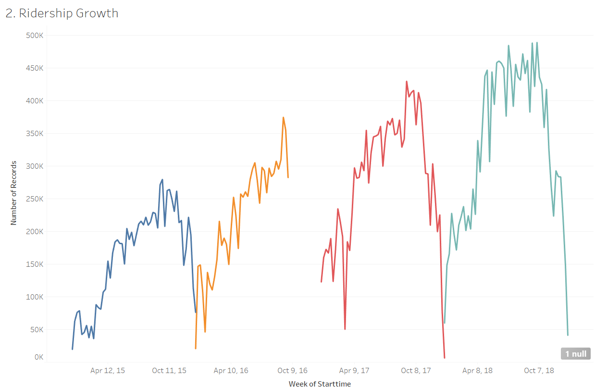{width="6.5in" height="4.652083333333334in"}

**Again no surprise here, very logical that the peak hours during the
summer months of June, July & August are early morning at 8am and peak
between 5 & 6pm.**

**5. What are the peak hours in which bikes are used during winter
months?**\
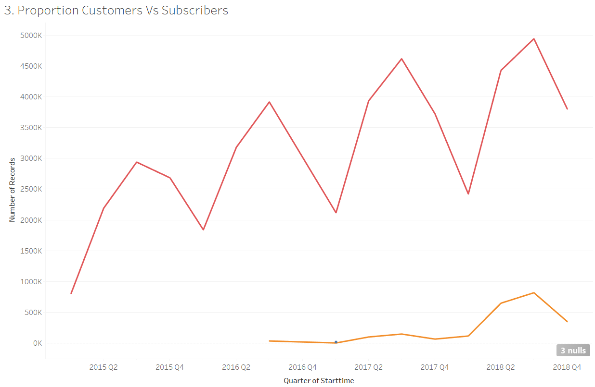{width="6.5in" height="5.011111111111111in"}\
Again no surprise here, very logical that the peak hours during the
summer months of December, January & February are early morning at 8am
and peak at 5pm.

**\
**

**6. Today, what are the top 10 stations in the city for starting a journey? (Based on data, why do you hypothesize these are the top locations?)** 
====================================================================================================================================================

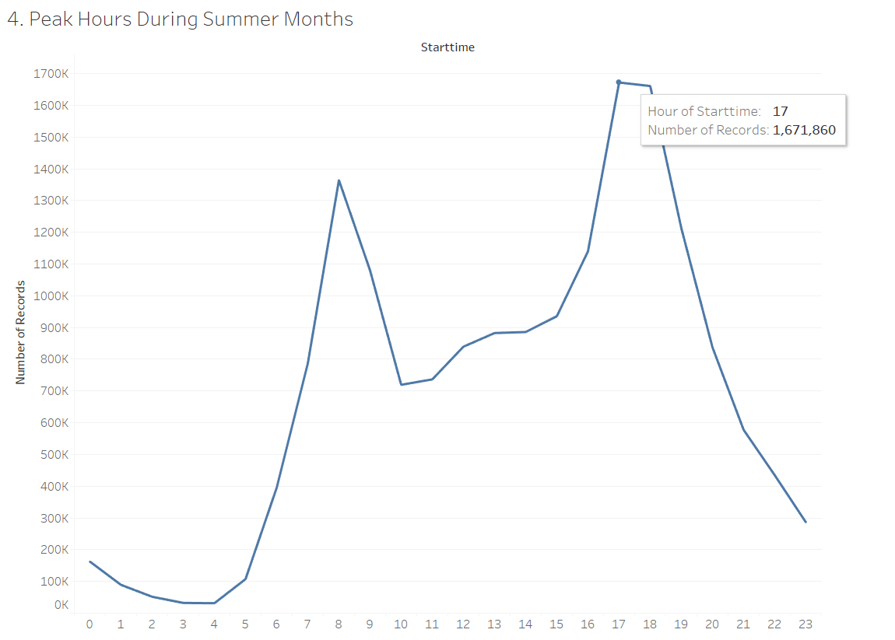{width="6.5in" height="1.7409722222222221in"}

So it seems that the top 10 starting stations are relatively close to
New York City Subway line.**\
\
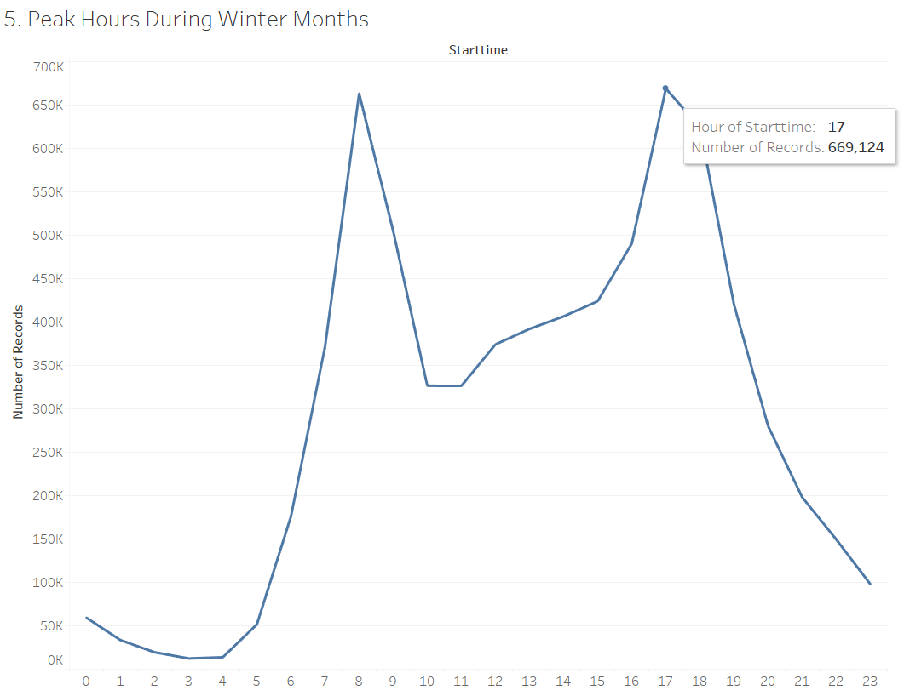{width="2.7270833333333333in"
height="3.530932852143482in"}
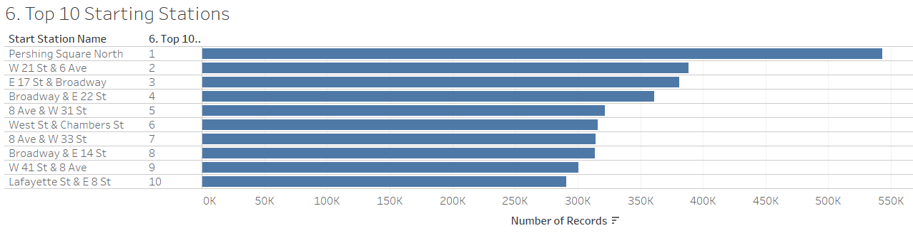{width="2.861570428696413in"
height="3.125in"}**\
**

**\
**

**7. Today, what is the gender breakdown of active participants (Male v.
Female)?**\
\
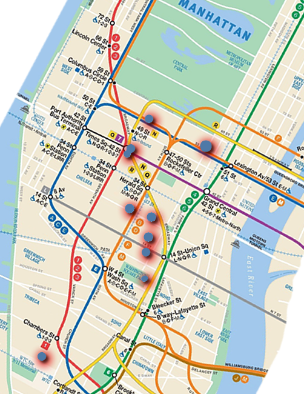{width="6.5in" height="3.696527777777778in"}\
\
Here is a chart that shows gender by birth year with the **Sum** of the
duration of the trips. While a vastly different graph below shows the
**AVG trip** duration is much more weighted towards older subscribers
enjoying the old style of transportation, perhaps during their bike
through central park during the day. I believe strongly that the 1935 /
2018 data for both male and females need to be weeded out. There a
smaller spike for males born in 1931 for the 2015 data set.\
\
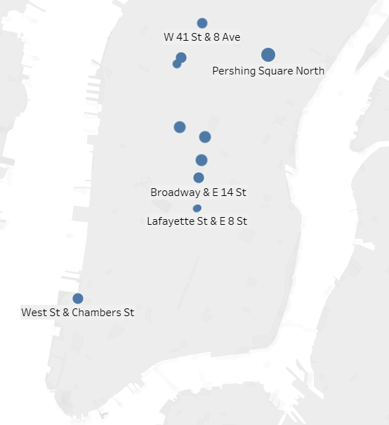{width="6.5in" height="3.7402777777777776in"}

**8. How does the average trip duration change by age?**
========================================================

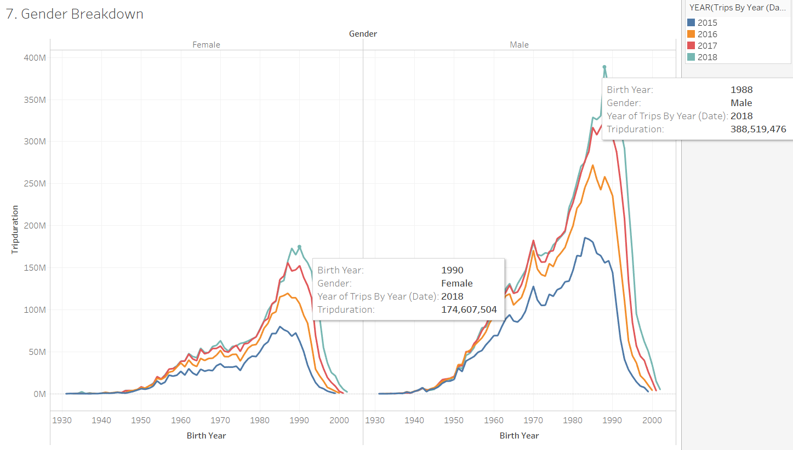{width="6.5in" height="3.6486111111111112in"}\
\
It would be worth diving deeper to analyze the spike in people born in
1935. After parsing out the graph, it's easy to see how there's an
anomaly in the 2018 data which is the root cause of the odd number
spike.\
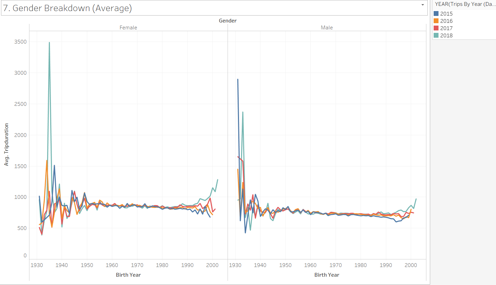{width="6.5in" height="3.6347222222222224in"}

**9. Which bikes (by ID) are most likely due for repair or inspection in the timespan?**
========================================================================================

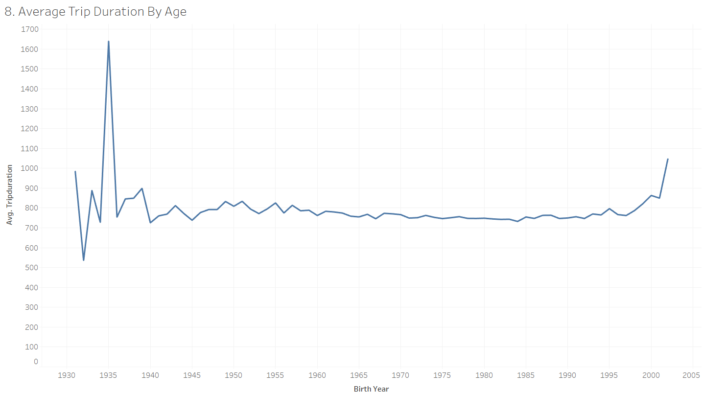{width="5.03125in" height="2.9203838582677166in"}\
\
While playing with the charts an interesting point revealed itself. The
above chart is showing the total records by Bike ID and it's logical
that the lower number bike ids ( in the 16k to 18k ranges ) are the
older bikes that have been on the services the longest since 2015 which
begged me to ask the question how could I show that which brought to me
to this graph by adding the year as a colour dimension.\
\
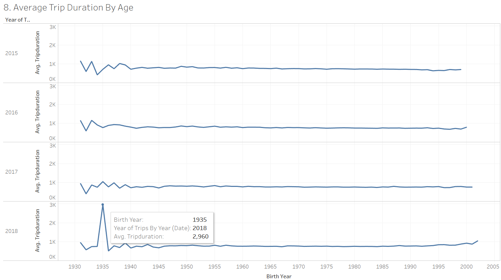{width="5.305758967629046in"
height="3.1006944444444446in"}\
\
There seems to be a real explosion of new bikes brought into service in
2016 and then a whole new wave in 2018.

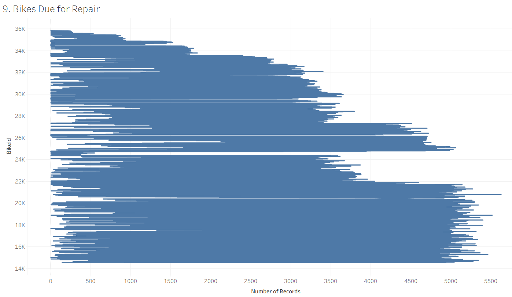{width="6.694665354330708in" height="2.09375in"}

**Well isn't that just delightful...\
\
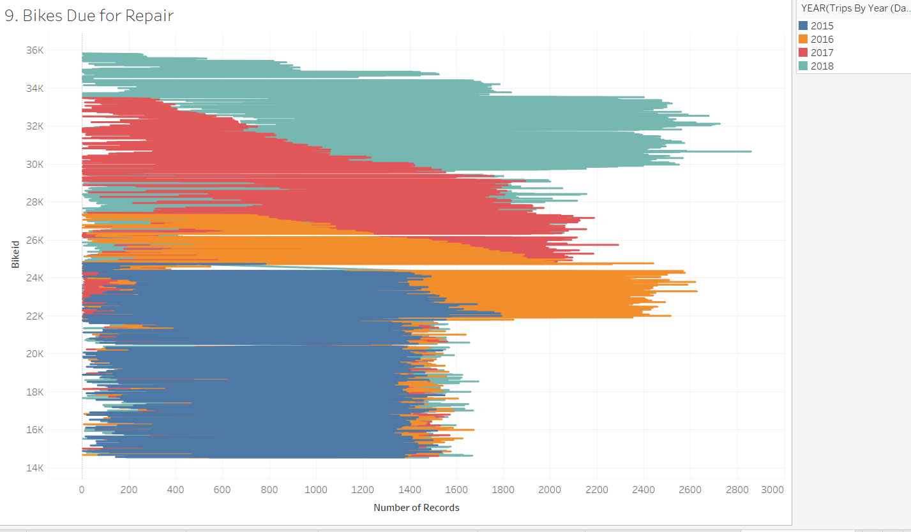{width="6.5in" height="2.1666666666666665in"}

**Steps taken to still publish effort to Tableau.**

**1. Source data filtered to only include 2015 data.\
**

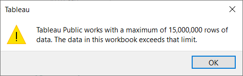{width="2.5729166666666665in"
height="2.829582239720035in"}**\
\
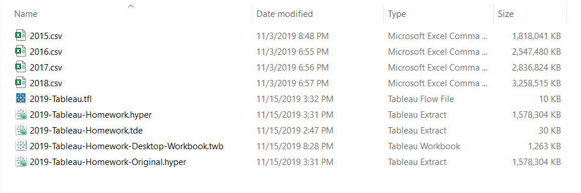){width="4.060500874890638in"
height="2.4094542869641296in"}**\
\
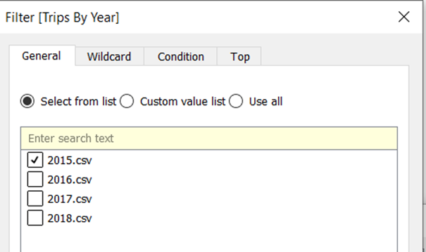{width="5.541666666666667in"
height="1.5104166666666667in"}**\
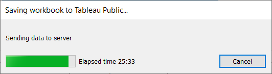{width="5.541666666666667in"
height="1.5104166666666667in"}**\
\
\
\
\
\
\
\
\
\
\
\
\
\
\
\
\
\
\
\
**
